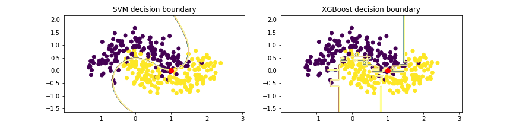
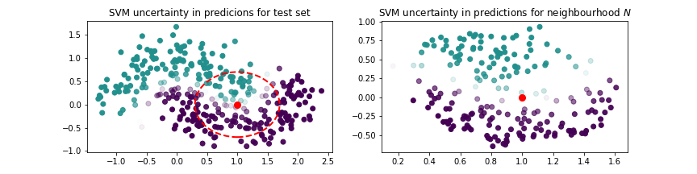
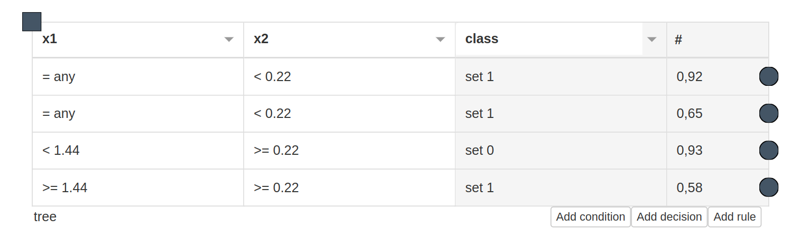

# LUX
## About
Local Uncertain Explanations -- brigns uncertianty into the explainable model in a straightforward way.
The workflow for LUX looks as follows:
  - You train an arbitrary selected machine learning model on your train dataset. The only requirements is that the model is able to output probabilities.
  
  - Next, you generate neighbourgood of an instance you wish to explain and you feed this neighbourhood to your model. This gives you training set to LUX, as the output form the model constains uncertainty of the decisions (probabilities of instance A being at class X)
  
  - You obtain a decision stump, which locally explains the model and is executable by [HeaRTDroid](https://heartdroid.re) inference engine
  
  - You can obtain explanation for a selected instance (the number after # represents confidence of an explanation):
  ```
  ['IF x2  < 0.01 AND  THEN class = 1 # 0.9229009792453621']
  ```

## Installation

First of all  clonde the repository and enter it:
```
git clone https://github.com/sbobek/lux.git
cd lux
```
Some of the packages used in LUX anre not available in conda, hence the following code should set up all of the requirements in virtual environment:

```
conda create --name luxenv
conda activate luxenv
conda install pip
pip install -r requirements.txt
```
## Usage

For complete usage see `lux_usage_example.ipynb`


# Cite this work

```
@InProceedings{lux2021iccs,
  author="Bobek, Szymon
  and Nalepa, Grzegorz J.",
  editor="Paszynski, Maciej
  and Kranzlm{\"u}ller, Dieter
  and Krzhizhanovskaya, Valeria V.
  and Dongarra, Jack J.
  and Sloot, Peter M. A.",
  title="Introducing Uncertainty into Explainable AI Methods",
  booktitle="Computational Science -- ICCS 2021",
  year="2021",
  publisher="Springer International Publishing",
  address="Cham",
  pages="444--457",
  isbn="978-3-030-77980-1"
}
